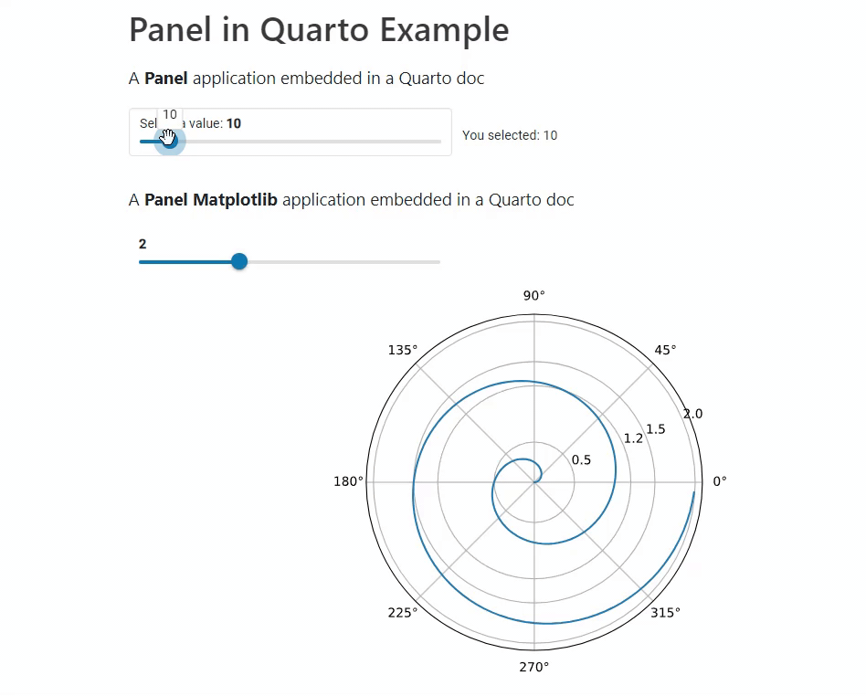
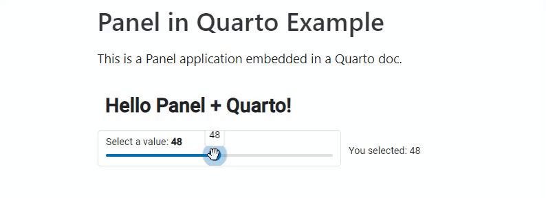

# Quarto HoloViz Extension

The purpose of this repository is to provide Quarto extensions for the HoloViz
ecosystem.

The focus is on including HoloViz generated plots and app in a way such that they are live and interactive. This means they will probably be powered by Pyodide/ PyScript.



DISCLAIMER: THIS IS **AN EXPERIMENT ONLY**. THE API MIGHT CHANGE. I DON'T WANT TO BE THE MAINTAINER OF THIS! I HOPE IT WILL BE A HOLOVIZ MAINTAINED PROJECT ONE DAY.

## Prerequisities

- Quarto. Check out their [Getting Started Guide](https://quarto.org/docs/get-started/).
- A Python environment.
  - `jupyter`, `panel` and the packages you will be using in your Quarto documents should be installed.

If you are a `conda` user, then you can install everything you need via

```bash
conda create -n quarto-holoviz -c conda-forge python=3.11 r-quarto perl hvplot matplotlib panel jupyter
```

or similar

## Installing

You can install the `quarto-holoviz` extension in your quarto project via

```bash
quarto add awesome-panel/quarto-holoviz
```

This will install the extension under the `_extensions` subdirectory. If you're using version control, you will want to check in this directory.

## Using

Put this in the header of your document, or in the `_quarto.yml` file:

```yaml
filters:
  - holoviz/quarto
```

Then you can put the code for a Panel application in a code block marked with {panel-app}.

````markdown
---
title: Panel in Quarto Examples
format: html
filters:
  - holoviz/quarto
---

This is a Panel application embedded in a Quarto doc.

```{panel-app-python}
import panel as pn

pn.extension(design="material")

slider = pn.widgets.IntSlider(name="Select a value", value=10, start=0, end=100)
pn.Column(
    "# Hello Panel + Quarto!",
    pn.rx("You selected: {}").format(slider),
).servable()
```
````



## Filters

The below *code block* filters can be used with the HoloViz ecosystem.

| Name | Extension | Description | Reference |
| - | - | - | - |
| `python` |  | A general filter for including Python | [example-python.qmd](example-python.qmd) |
| `panel-app-python` | `holoviz/quarto` | A custom filter for including Panel apps using `.servable` | [example.qmd](example.qmd) |
|  |  | How to use Panel with Pyscript and Quarto | [example.qmd](example-pyscript.qmd) |

## Development

```bash
git clone https://github.com/awesome-panel/quarto-holoviz
conda create -n quarto-holoviz conda-forge r-quarto perl matplotlib panel hvplot jupyter
```

To setup your development environment and learn more about quarto development check out the [Quarto Lua Development Guide](https://quarto.org/docs/extensions/lua.html).

To preview the example run

```bash
quarto preview example.qmd --port 5008
```

## Resources

- [Creating Quarto Extensions](https://quarto.org/docs/extensions/creating.html)
- [Quarto Extensions](https://quarto.org/docs/extensions/listing-filters.html)
  - [shinylive extension](https://github.com/quarto-ext/shinylive)
  - [stlite extension](https://github.com/whitphx/quarto-stlite)
